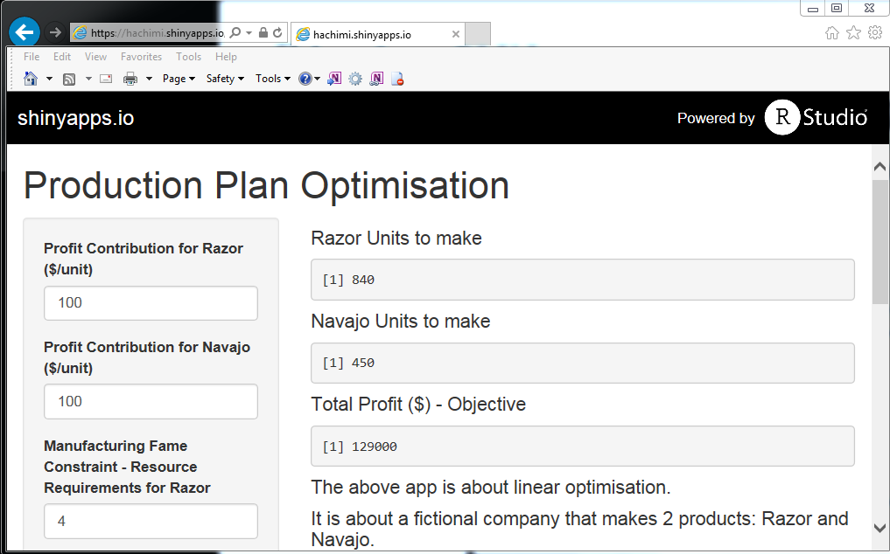
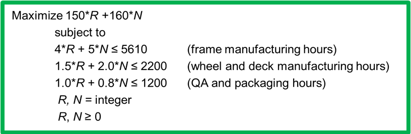

<style type = "text/css">
code.r{font-size: 12px;}
</style>

## Intro & Description
The above app is about linear optimisation (like what solver does in MS Excel).

It is about a fictional company that makes 2 products: Razor and Navajo. It is assumed that the company is so profitable that it can sell all its products.

The production process of each product includes 3 main steps:
- Manufacturing Frame.
- Wheels & Deck Assembly. 
- QA & Packaging.  

The capacity (in hours) at each production step is assumed to be: 5610, 2200, 1200 respectively. So the main goal are to determine How many units of each model should be produced in order to maximise profit. Hence the app will compute the number of units of each model and the maximum profits available. Therefore, the user just needs to input the values and the app will compute the above objective.

Note: that no negative values should be entered.

--- .class #2

## Shiny App: Production Plan Optimisation


--- .class #3

## Linear Constraints

In order to run the application, there are some linear constrainst built in that need to be taken into consideration. The constrains can be summarised in the picture below.



In the picture above, R and N represent the two product models, i.e. Razor and Navajo respectively.

--- .class #4

## Model Behind the App

The model used in the app is built using the lpSove package (similar to solver in Excel).


```r
require(lpSolve)
obj <- c(135, 170) #Coefficients of objective funtive to maximise
con <- matrix(c(4,5,1.5,2,1,0.8), nrow = 3, byrow = TRUE) # Matrix coefficients of the constraints      
rel = c("<=", "<=", "<=") # Contrainst operator
rhs = c(5610, 2200, 1200) # Contraints treshold
my.lp = lp("max", obj, con, rel, rhs)
my.lp$solution # Gets the solution, i.e. the number of units to produce
```

```
## [1] 440 770
```

```r
my.lp$objval # Get the objective value, i.e. the maximum profits 
```

```
## [1] 190300
```

**Where the idea came from**
The linear model used to build this App is a model I picked up from the Coursera Course (Operations Analytics). However, the Operations Analytics course is entirely taught in Excel and doesn't involve any R coding. https://www.coursera.org/learn/wharton-operations-analytics/home/week/2


